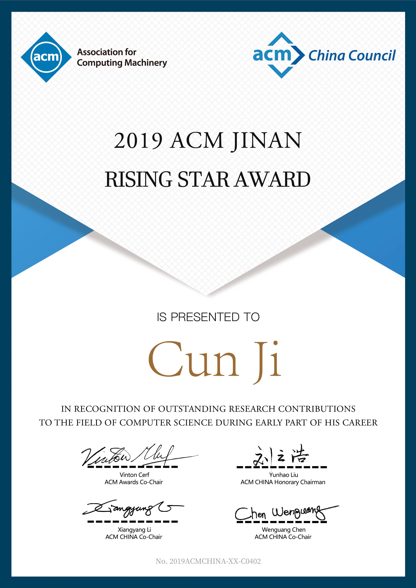

[个人简介/Biography](./index.md)&nbsp; &nbsp; &nbsp; &nbsp; [论文/Publication](./publication.md)&nbsp; &nbsp; &nbsp; &nbsp; [项目/Project](./project.md)&nbsp; &nbsp; &nbsp; &nbsp; [主要荣誉/Honor](./honor.md)

- 2019 ACM Jinan Rising Star Award (2019 ACM济南 新星奖)

- SSYSF Outstanding student award (服务计算学会优秀学生奖)
- 第36届中国数据库学术会议（NDBC 2019）萨师煊优秀学生论文奖<!--：《融合选择性提取与子类聚类的快速时间序列shapelet发现算法 》 赵超，王腾江，刘士军，潘丽，嵇存-->
