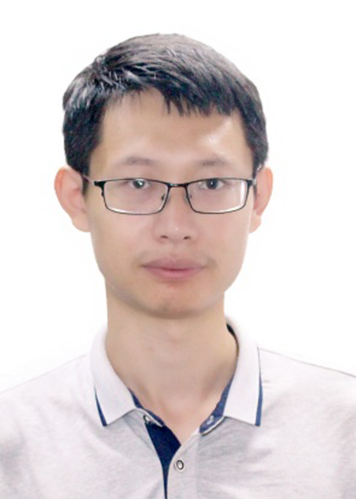

[个人简介/Biography](./index.md)&nbsp; [项目/Project](./project.md)&nbsp; [论文/Publication](./publication.md)&nbsp;  [专利/Patent](./patent.md)&nbsp; [主要荣誉/Honor](./honor.md)&nbsp; [指导学生/My Students](./student.md)

嵇存， 硕士生导师、讲师。
 
山东师范大学信息科学与工程学院讲师、硕士生导师。山东高密人，分别于2017年和2012年获得山东大学博士、学士学位。先后参与国家重点研发计划、国家自然科学基金等国家级课题；在Computer Network等国际期刊以及Cloud2016等学术会议发表论文20余篇；申请或授权发明专利7项、软件著作权1项。曾获得了ACM China 学术新星奖(济南分会)、SSYSF Outstanding student award（服务计算协会杰出学生奖）、萨师煊优秀学生论文奖。曾担任2019 2nd International Conference on Big Data Technologies（ICBDT，2019年第二届大数据科技国际会议）等会议的Program Chairs；现为ACM Transactions on Intelligent Systems and Technology (ACM TIST), IEEE Transactions on Industrial Informatics (TII), Complex & Intelligent Systems, Computational Intelligence and Neuroscience，Journal of Computational Methods in Sciences and Engineering (JCMSE), American Journal of Data Mining and Knowledge Discovery, Indonesian Journal of Electrical Engineering and Informatics等期刊审稿人。主要研究方向为时间序列分析、智能制造、大数据等

 
 
 

**Dr. Cun Ji** is currently a lecturer with the Shandong Provincial Key Laboratory for Distributed Computer Software Novel Technology, School of Information Science and Engineering, Shandong Normal University. His main research interests include time series analysis， intelligent manufacturing and big data.

#招生方向
计算机技术  1~2名

## 联系方式/Contact Information
Email: jicun@sdnu.edu.cn

